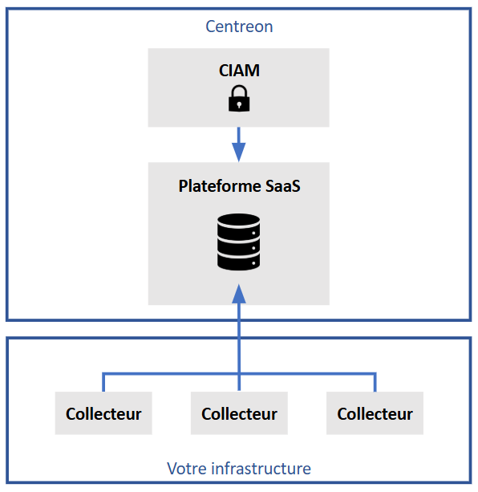

Votre plateforme Centreon Cloud est constituée principalement d'une plateforme SaaS fournie par Centreon, et de collecteurs que vous installez dans votre infrastructure. De plus, le module Centreon [CIAM](../ciam/ciam.md) vous permet de gérer vos organisations et vos utilisateurs, et de vous connecter à Centreon Cloud.

* **Plateforme SaaS** :
  * La plateforme SaaS vous est fournie par Centreon, prête à l'emploi.
  * La plateforme SaaS ne supervise pas de ressources au sein de votre infrastructure (c'est le rôle des collecteurs).
  * La plateforme SaaS offre une [interface utilisateur](interface.md), dans laquelle vous pouvez voir toutes les ressources supervisées par tous les collecteurs.
  * Vous pouvez vous connecter à l'interface utilisateur depuis n'importe où en tapant `<organisation>.<region>.centreon.cloud` dans votre navigateur web.
  * Le serveur central est hosté dans le cloud.
  * Centreon installe et met à jour la plateforme SaaS.

* **Un ou plusieurs collecteurs** :
  * Les collecteurs supervisent des ressources dans votre infrastructure. Ils doivent être situés dans le même réseau que les ressources à superviser.
  * Les collecteurs eux-mêmes n'ont pas d'interface utilisateur (l'activité des collecteurs est visible sur l'interface utilisateur de la plateforme SaaS).
  * Les collecteurs sont situés dans votre infrastructure, ce qui veut dire une meilleure sécurité, latence et bande passante.
  * Vous [installez vos collecteurs](../installation/deploy-poller.md) à l'aide d'un simple script.
  * La communication entre le central et les collecteurs se fait en HTTPS.

## Centreon CIAM

* Le [CIAM](../ciam/ciam.md) a une interface utilisateur distincte de celle de la plateforme SaaS.
* Avant de pouvoir utiliser Centreon Cloud, vous devez configurer votre organisation dans le CIAM, et inviter vos utilisateurs sur la plateforme.
